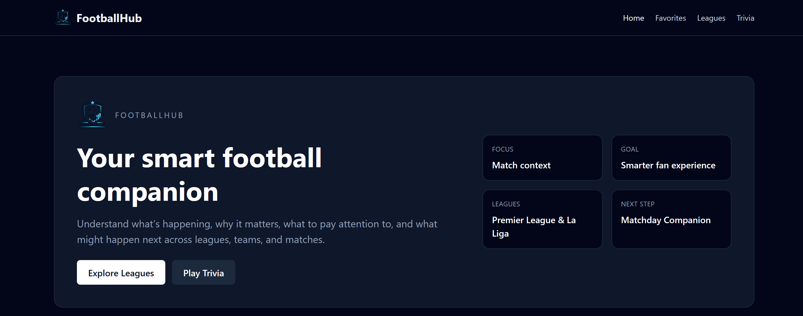
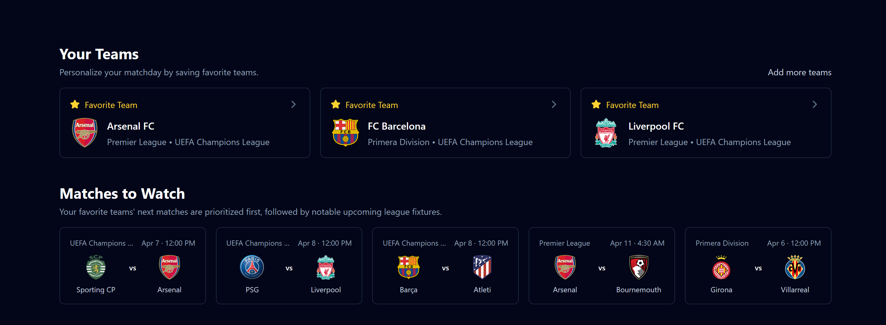
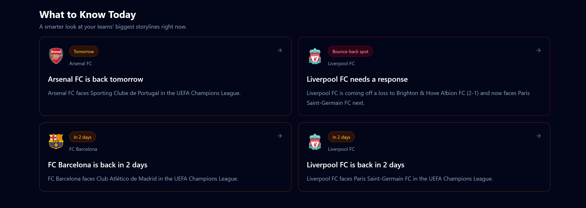
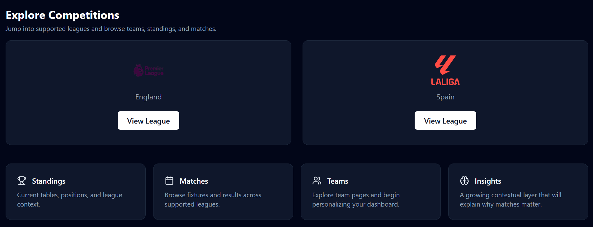
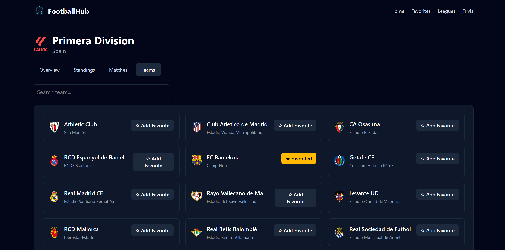
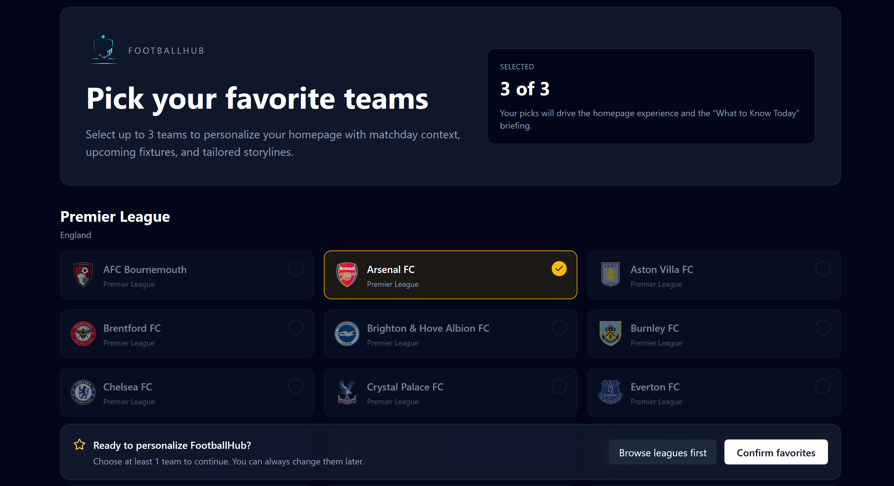

# FootballHub ⚽

FootballHub is a football companion web app focused on **context**, not just raw match data.

The current version helps users follow matches, teams, and leagues while also surfacing lightweight insights such as team form, standings pressure, and upcoming-match storylines. The long-term idea is to move closer to a smarter matchday experience: a product that helps fans understand not only **what is happening**, but also **why it matters**.

---

## Overview

A lot of football apps are already very good at listing fixtures, results, and tables. What interested me more with this project was the product question behind them:

- What should a fan notice first?
- What makes a match important?
- How can a homepage feel personal instead of generic?
- How can context be surfaced without overwhelming the user?

FootballHub is my attempt at exploring those questions through a clean web app built around favorite teams, match pages, and a rules-based insight layer.

---

## Current State

The app currently includes:

- **Favorite teams personalization**
  - Users can select favorite teams and get a more personalized homepage experience.
- **League browsing**
  - Explore supported competitions, standings, teams, and matches.
- **Team pages**
  - View team details and recent/upcoming matches.
- **Match pages**
  - Open individual matches and view contextual summaries (improvements in progress).
- **Homepage insight sections**
  - “Matches to Watch” prioritizes favorite teams and nearby important fixtures.
  - “What to Know Today” surfaces lightweight storylines based on recent form, upcoming matches, and standings position.
- **Trivia**
  - A smaller engagement feature that complements the main football experience.

This is **not** a full production sports platform, and it is not trying to compete feature-for-feature with larger products. The project is currently much more focused on the idea of a **smart football companion** and on building a polished, thoughtful product experience around that idea.

---

## Product Direction

The long-term direction for FootballHub is:

> a football app that helps users understand what is happening, why it matters, what to watch for, and what might happen next.

Right now, that vision is implemented through a **rules-based insight layer** rather than a deeply intelligent prediction system. That was a deliberate decision.

Instead of trying to over-engineer a perfect “football intelligence engine” too early, I focused first on:

- strong core navigation
- a personalized homepage
- clear team and match pages
- contextual insights that are understandable and maintainable

That keeps the app realistic, demoable, and easier to improve over time.

---

## Why It Was Built This Way

A few design decisions shaped the current version:

### 1. Personalization first

The homepage is centered around favorite teams because that immediately makes the experience feel more useful and more product-like.

### 2. Rules-based context instead of “magic”

The current insight system uses recent results, standings position, next matches, and opponent context to generate storylines. It is intentionally simple enough to be understandable and maintainable.

### 3. Match and team pages as anchors

Rather than only showing league-level data, the app gives users direct routes into team pages and match pages, where context can become more focused.

### 4. Conservative data usage

FootballHub uses the free football-data.org API tier, so the app has to be thoughtful about how much data it requests and when. That influenced how the homepage, favorites flow, and insight features were designed.

---

## Technical Stack

- **Frontend:** React + Vite
- **Data Fetching / Caching:** TanStack Query
- **Styling:** Tailwind CSS
- **Routing:** React Router
- **Icons:** Lucide React
- **Data Source:** football-data.org

---

## Constraints and Tradeoffs

This project intentionally works within a few limitations:

- The app uses a **free API tier**, so requests need to be kept relatively efficient.
- The current insight layer is **rules-based**, not predictive or AI-driven.
- The supported competitions are currently focused on the leagues most relevant to the current product experience.
- Some contextual statements are intentionally conservative, because they are generated from available API data rather than a much richer event/statistics model.

These constraints are part of the project, not just shortcomings. They pushed me to think more carefully about:

- data prioritization
- UX hierarchy
- caching
- product tradeoffs under real-world limits

---

## What Could Be Improved Next

There are several directions I would take this further:

### Smarter context generation

The current storylines are useful, but they could become more sophisticated by:

- reasoning more deeply about opponent quality
- detecting bigger table swings
- modeling title-race / top-four / relegation pressure more intelligently
- improving narrative wording so insights feel even more editorial

### Better homepage orchestration

The homepage could become smarter about:

- which favorite-team matches to prioritize
- how many storylines to show per team
- balancing urgency, form, and table context

### More complete onboarding and preference management

The favorite-team selection flow is already part of the experience, but it could be expanded with:

- clearer editing controls
- stronger preference persistence
- better first-run explanations

### Broader data coverage

If this were taken further with stronger API access or a more advanced backend, I would want to explore:

- more competitions
- richer player/team context
- more advanced match importance logic
- more dynamic homepage ranking

### Production polish

For a larger real-world version, I would likely add:

- stronger error boundaries
- better loading skeletons across all pages
- analytics
- testing coverage
- a backend/cache layer to reduce direct client-side API pressure

---

## Why This Project Matters to Me

I wanted this project to be more than “a football API app.”

The interesting part for me is the product challenge:
how to turn football data into an experience that feels **helpful, focused, and worth returning to**.

That is why this project emphasizes:

- user flow
- hierarchy of information
- contextual summaries
- product identity

more than just raw API integration.

---

## Screenshots








---

## Live Demo

<!-- Add deployed demo link here -->
<!-- Example:
https://footballhub.vercel.app
-->

---

## Installation

```bash
git clone https://github.com/bryanpartida/footballhub.git
cd footballhub
npm install
npm run dev
```

---

## Environment Variables

Create a .env.local file in the project root:

```bash
VITE_FOOTBALL_DATA_TOKEN=your_api_key_here
```
